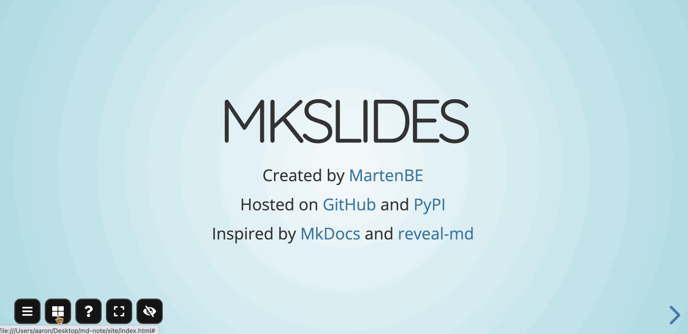

### Preview image




<br />

### MD-slideshow

This project demonstrates how to generate beautiful slideshows using [MkSlides](https://github.com/MartenBE/mkslides) or [reveal-md](https://github.com/webpro/reveal-md). you need to install them first.

Download this project, open a terminal, switch to this project's directory use `cd`, and then follow the README prompts for the `MkSlides` and `reveal-md` to run it.

Thanks to both of them for their open source contributions.


### Use MkSlides

```python
mkslides build docs/demo.md
mkslides build docs/
```


#### preprocessing

Just turn on the switch of  `preproc.py` in `mkslides.yml`.


### Use reveal-md

```bash
reveal-md docs/demo.md --static _site
```


#### preprocessing

You need to add the path of `preproc.js` to the build command.

```bash
reveal-md --preprocessor preproc.js docs/demo.md --static _site
```


### Directory tree

```bash
.
├── _site          # reveal-md static site generated after a build
├── site           # MkSlides static site generated after a build
├── docs                   # markdown document
│   └── demo.md
├── plugin                 # plugin directory
│   ├── reveal.js-menu
│   │   └──menu.js
│   └── other-plugin
│       └──other-plugin.js
├── plugin.js            # for reveal-md
├── preproc.js           # for reveal-md
├── reveal-md.json       # for reveal-md
├── reveal.json          # for reveal-md
├── preproc.py     # for MkSlides
└── mkslides.yml   # for MkSlides
```


### Notes

1. A total of 5 plugins are demonstrated: `mermaid, plantuml, chart, menu, toolbar`, It's all been tested. It all works.
2. Some plugins have not been updated and maintained for a long time, so there will be some bugs, such as `toolbar`, but does not affect normal use!
3. When using `reveal-md`, if you want to use the `menu` plugin correctly, you need to manually copy the current `plugin/reveal.js-menu` directory to the project directory `_assets/plugin/` after the build, overwriting the original one. this is because reveal-md will copy all the static resources and dependencies to the build directory according to the config file when it runs, and because the way the menu plugin is written depends on other config files, this will cause reveal-md to under-copy some files when it builds.

